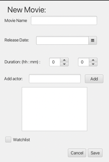
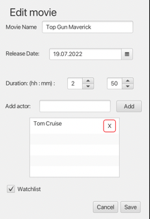

[](https://gitpod.stud.ntnu.no/#https://gitlab.stud.idi.ntnu.no/it1901/groups-2022/gr2238/gr2238/-/tree/master/)
# My Movie Tracker

My movie tracker is a project for the course IT1901. 

Functions currently implemented in the application: 
- Add movies to the database.
- Edit current movies in the database.
- Make a review of the movie.
    - Comment the movie.
    - Rate the movie from 1-10.
- Delete a movie from the database.
- Sort movies by:
    - Title.
    - Rating
    - Duration 
- Take of/take on watchlist


## Building and running the project
The project is built using maven, and therefore maven must be used, to run the project.

If you are in the root folder **gr2238**, you will have to change directory to **mmt** before continuing. Perform:

```
cd mmt
```

You should now be in the correct folder.
### Build the project
To build the project, perform:

```
mvn clean install
```
This will clean the maven project, and build it from scratch.

### Running the project
To run the javafx part of the project you have two opportunities, either perform:

```
mvn javafx:run -f fxui/pom.xml
```

Or perform this:
```
cd fxui
mvn javafx:run
```

This should open a new window with the application. From here you can add movies to the database.

### Testing the project
To perform all of the test, you can use:

```
mvn test
```

This will run all of the test, and give you a feedback on how many that succeded. If you only want to perform tests in one module, you can use `cd core` or `cd fxui` and then perform `mvn test`.

After you have run the test, there will open a new folder in each of the modules target folder. The folders name is site/jacoco. In this folder, there will be an index.html. This can be opened in a web browser, to look at the test coverage.

### Building the project in GitPod
To build the project in gitpod, simply press the button at the top of this file. From here, a code enviroment will open. To run the project, use the same commands stated above.

## Shippable product - Export the project
The goal with making the project shippable, is to be able to open the app without using an editor or maven commands. This will download an app that the user can place on their own computer. The plugin JLink assembles the projects modules and dependencies into a new folder using the JavaFx developers plugin. JPackage is the pluging that creates the app for the user.  

To run this plugin you have to be in a terminal window. From there, you have to `cd`into the `fxui`folder. From there you can run the following command:

```
mvn clean compile javafx:jlink jpackage:jpackage
```
This will generate a `.dmg` file in the `mmt/fxui/target/dist` folder. This will give the app that it can use to open the MMT app.

## Finished product
When the project is finished, the plan is that a user can add search up movies in the database, give them ratings and add them to their watchlist. You will also be able to sort movies, based on ratings and categories. More functionalities will be added if we see it necessary.

### Main page
This is the main page of My Movie Tracker. The user is now able to add a new movie to the database, edit the movie, review the movie and delete the movie from the database. It is also possible to sort the movies by title, rating and duration by clicking on the "Sort" button. The button located below sort will show all movies added to the users watchlist when clicked.


### New Movie
When the "New Movie" button is clicked, the new movie page will appear on the screen. As the picture shows, the user will have the opporunity to set title, release date, duration and if wanted, put the movie on the watchlist.



### Edit

The "Edit" button will show a new page where the user can edit a movie. As shown in the picture, the current fields of the movie will show in the input spaces. The user will easely be able to edit the movie by changing the current value of an input space to something else.



### Review
The "Review" button will also show a new page. This page enables the user to review a movie. The user can leave a comment on the movie and rate the movie from 1-10. 


