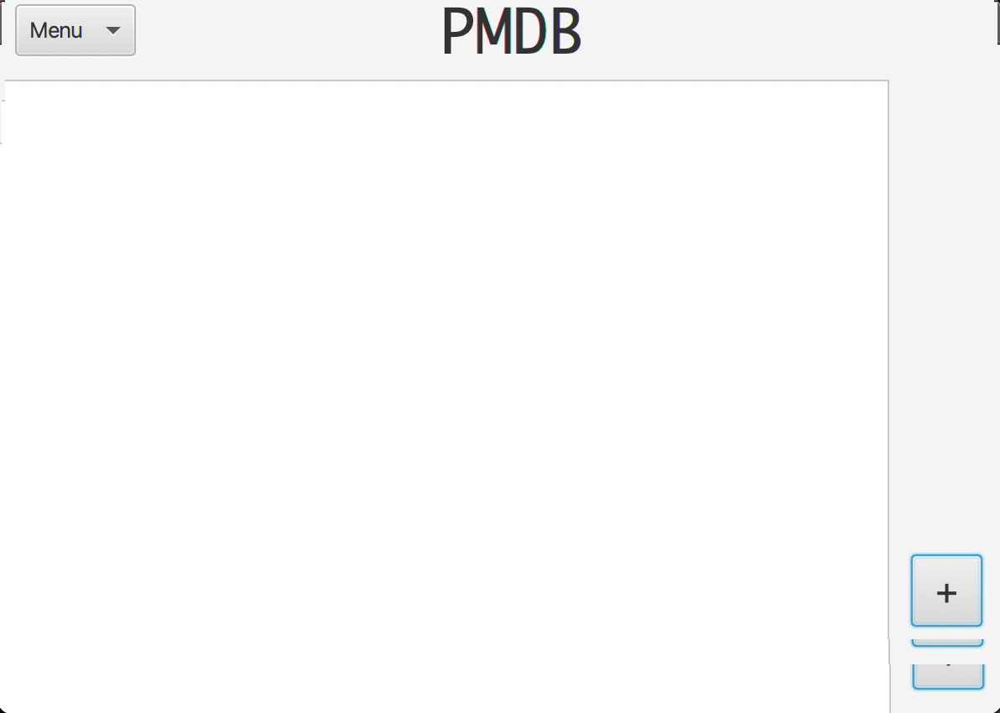
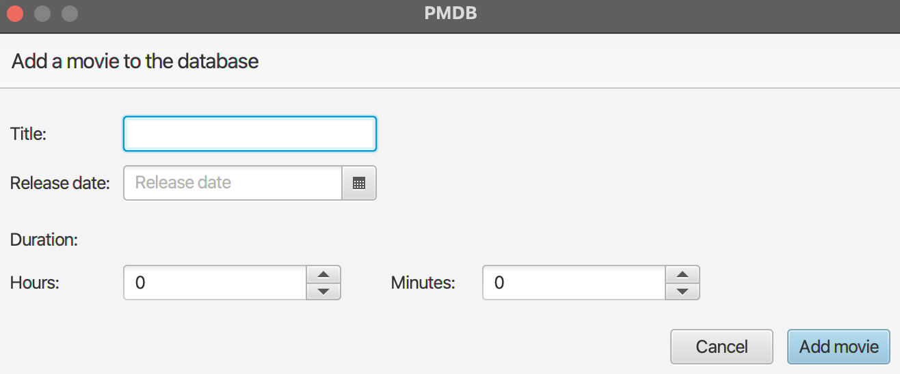

My movie tracker (MMT):

MMT is an app where the user can store and look up information about movies. 
The first draft of the app enables the user to add a movie to the database. All movies added will be shown in the frontpage of the app.

What to see:
- Frontpage of the app.
- Menu in the top left corner.
- Add movie button in the bottom right corner.
- List of movies when added.

What to do:
- Add movie to database.
- Set title, release date and duration to movie.

Frontpage:

Add movie:

